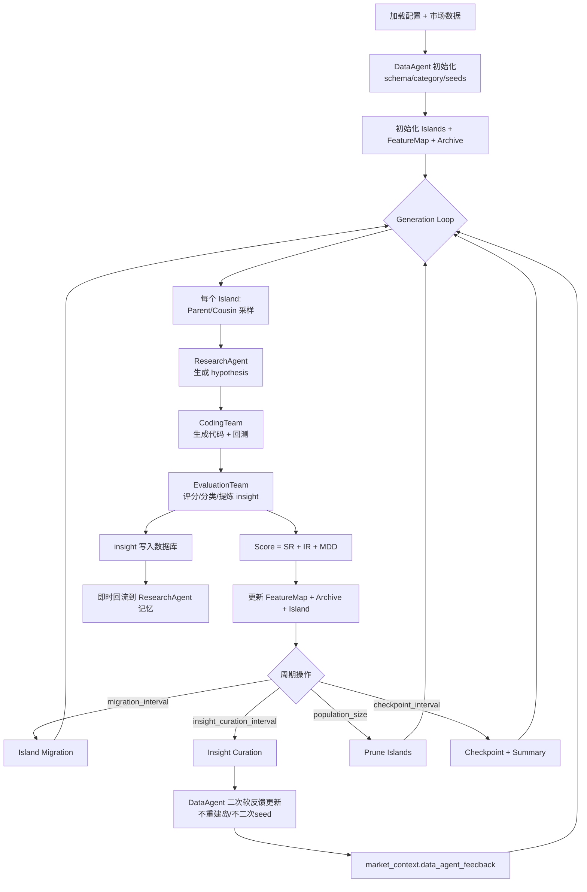

# QuantEvolve

QuantEvolve 是一个“多智能体 + 进化搜索 + 回测评估”的量化策略发现框架。  
核心目标是自动生成、测试、评估并保留“高质量 + 多样化”的策略集合，而不是只追单一最优解。

---

## 1. 一句话理解系统

系统先用 `DataAgent` 做一次性初始化（数据理解 + 种子策略），然后进入代际循环：  
`Selection -> ResearchAgent -> CodingTeam -> EvaluationTeam -> FeatureMap/Archive`，  
并在周期点执行 `migration / insight curation / DataAgent 软反馈更新 / checkpoint`。

---

## 2. 完整架构图（当前代码真实流程）



---

## 3. 目录结构与职责

| 路径 | 角色 | 核心内容 |
|---|---|---|
| `src/main.py` | 程序入口 | 解析参数、加载配置、启动进化、产出可视化与汇总 |
| `src/evolutionary/algorithm.py` | 主编排器 | 组织全部组件、执行代际循环、维护反馈与持久化 |
| `src/evolutionary/feature_map.py` | 质量-多样性档案 | 6维特征分箱、cell替换规则、archive状态 |
| `src/evolutionary/selection.py` | 采样器 | parent/cousin 采样、特征扰动、距离计算 |
| `src/evolutionary/island_manager.py` | 岛模型管理 | 岛初始化、迁移、剪枝、统计 |
| `src/agents/data_agent.py` | 数据智能体 | 初始化 schema/category/seeds；周期软反馈分析 |
| `src/agents/research_agent.py` | 研究智能体 | 基于上下文生成结构化 hypothesis |
| `src/agents/coding_team.py` | 编码智能体 | hypothesis -> 策略代码 -> 回测 -> 失败重试 |
| `src/agents/evaluation_team.py` | 评估智能体 | 假设/代码/结果评估，策略分类，insight提炼 |
| `src/backtesting/*` | 回测层 | 回测引擎、绩效指标、滑点模型 |
| `src/prompts/*` | 提示词层 | 四类 agent 的 prompt 模板 |
| `src/utils/*` | 工具层 | 日志、可视化、数据读取 |
| `config/*.yaml` | 配置层 | 默认参数、股票与期货场景参数 |

---

## 4. 运行时核心对象（所有结构）

## 4.1 `market_context`

由 `algorithm.py` 在运行开始时构建，并在周期反馈时追加字段。

关键字段：
- `market_type`
- `assets`
- `benchmark`
- `train_start`
- `train_end`
- `frequency`
- `data_agent_feedback`（周期软反馈新增）

## 4.2 `Strategy`（`src/evolutionary/feature_map.py`）

字段：
- `id`
- `hypothesis`
- `code`
- `metrics`
- `analysis`
- `feature_vector`
- `generation`
- `island_id`
- `score`
- `timestamp`

## 4.3 `EvolutionaryDatabase`（`src/evolutionary/algorithm.py`）

字段：
- `feature_map`
- `archive`
- `generation_counter`
- `total_strategies_evaluated`
- `insights_repository`
- `feature_map_snapshots`
- `generation_metrics`
- `insights_timeline`
- `strategy_returns`
- `benchmark_returns`

作用：
- 存放主循环产生的所有策略与反馈数据。
- 提供 checkpoint、top strategy、可视化所需快照。

## 4.4 `FeatureMap`

核心维度（6维）：
1. `strategy_category`（8-bit 编码索引）
2. `trading_frequency`
3. `max_drawdown`
4. `sharpe_ratio`
5. `sortino_ratio`
6. `total_return`

更新规则：
- 新 cell：直接写入。
- 已占用 cell：仅当新策略 `score` 更高时替换。

---

## 5. Agent 层接口与职责（清晰版）

## 5.1 DataAgent

路径：`src/agents/data_agent.py`

职责分两段：
1. 初始化阶段  
- 分析数据结构（schema）  
- 识别策略类别（C）  
- 生成 C+1 种子策略（含 benchmark）  
2. 周期反馈阶段  
- 使用近期 insight 重新分析 schema/category  
- 产出 `data_agent_feedback` 写入 `market_context`

说明：
- 当前实现是“软反馈更新”，不重建 island，不二次 seed。

## 5.2 ResearchAgent

路径：`src/agents/research_agent.py`

职责：
- 综合 `parent + cousins + insights + market_context` 生成新 hypothesis（XML/结构化内容）。

输入重点：
- parent 策略摘要
- cousin 策略摘要
- 当前代数
- `market_context`（会包含 DataAgent 反馈）

## 5.3 CodingTeam

路径：`src/agents/coding_team.py`

职责：
- hypothesis 翻译为 Zipline 策略代码。
- 运行回测，失败时进行有限次重试修复。

输出重点：
- `code`
- `metrics`
- `success` / `error`
- `returns_series`
- `benchmark_returns`

## 5.4 EvaluationTeam

路径：`src/agents/evaluation_team.py`

职责：
- `evaluate_hypothesis`
- `evaluate_code`
- `analyze_results`
- `categorize_strategy`
- `extract_insights`

产物：
- 多维评分
- 分类 bit
- insight（立即回流数据库，并喂给 ResearchAgent）

---

## 6. 进化层结构（Selection / Island / FeatureMap）

## 6.1 Parent Selection

文件：`src/evolutionary/selection.py`

机制：
- 在 elite（FeatureMap已归档）与全岛随机之间按 `alpha` 平衡。

## 6.2 Cousin Selection

机制：
- 组合 `best + diverse + random`。
- diverse 通过特征扰动实现（连续维高斯扰动 + category bit flip）。

## 6.3 IslandManager

文件：`src/evolutionary/island_manager.py`

机制：
- 多岛并行维护子种群。
- ring 拓扑迁移。
- 按配置进行 population prune。

## 6.4 FeatureMap & Archive 协同

- FeatureMap 负责“每个 niche 的当前最优代表”。
- Archive 负责“全历史策略记录”（包含未占据 cell 的策略）。

---

## 7. 端到端执行顺序（按时间）

## 阶段 A：启动

1. 读取配置并归一化兼容键。  
2. 初始化组件（FeatureMap/Islands/Agents/Backtest/Logger）。  
3. 读取市场数据。

## 阶段 B：一次性初始化

1. DataAgent 完成 schema + category + seed。  
2. seed 写入 islands 与数据库。  
3. 初始化完成后进入 generation loop。

## 阶段 C：每代每岛

1. 选 parent。  
2. 选 cousins。  
3. Research 产 hypothesis。  
4. Coding 产代码并回测。  
5. Evaluation 评分、分类、提 insight。  
6. 计算 `score=SR+IR+MDD`。  
7. 更新 FeatureMap + Archive + Island。  
8. insight 入库并即时喂给 ResearchAgent。

## 阶段 D：周期操作

1. Migration。  
2. Insight Curation。  
3. DataAgent 软反馈更新到 `market_context`。  
4. Population prune。  
5. Checkpoint 与 generation summary。

## 阶段 E：结束输出

1. `final_checkpoint.json`  
2. `top_strategies.json`  
3. `feature_map_final.json`  
4. `evolution_summary.json`  
5. 可视化图（如果启用）

---

## 8. 反馈回路（重点说明）

当前代码里有两条反馈线：

1. 即时反馈：`Evaluation -> Research`
- 每个新策略的 insight 会即时写入 `ResearchAgent` 的 insights memory。

2. 周期反馈：`Evaluation/DB -> DataAgent -> market_context`
- 在 curation 触发点，DataAgent 根据近期 insight 做二次分析。  
- 输出 `data_agent_feedback`，供后续 hypothesis 生成参考。  
- 不触发重建岛，不触发二次 seed。

---

## 9. 配置项与结构映射

主要配置来源：`config/default_config.yaml` + 场景配置（equity/futures）

关键配置对照：
- `evolution.generations`：总代数
- `evolution.alpha`：parent exploitation/exploration 平衡
- `evolution.migration_interval`：迁移周期
- `evolution.insight_curation_interval`：insight curation 周期
- `feature_map.*`：分箱与维度范围
- `islands.num_islands`：岛数量
- `cousin_selection.*`：cousin 采样参数
- `backtesting.*`：回测费用/滑点/频率等
- `insights.max_size`：insight 上限
- `checkpoints.*`：checkpoint 目录与周期

注：
- 代码含配置归一化层，兼容 `checkpoint`/`checkpoints`、部分扁平与嵌套键。

---

## 10. 输入输出目录结构

输入数据：
- `data/equities/<SYMBOL>.csv|parquet`
- `data/futures/<SYMBOL>.csv|parquet`

输出结果：
- `results/logs/`
- `results/checkpoints/`
- `results/metrics/`
- `results/strategies/`
- `results/insights/`
- `results/visualizations/`

---

## 11. 快速运行

安装依赖：

```bash
pip install -r requirements.txt
```

运行（股票）：

```bash
python src/main.py --config equity
```

运行（期货）：

```bash
python src/main.py --config futures
```

指定代数：

```bash
python src/main.py --config equity --generations 200
```

从 checkpoint 恢复：

```bash
python src/main.py --config equity --resume results/checkpoints/checkpoint_gen50.json
```

---

## 12. 当前边界与下一步建议

1. DataAgent 已接入二次软反馈，但未做自动重建岛（这是当前设计选择）。  
2. 回测链路仍有 `CodingTeam` 与 `BacktestingEngine` 双路径，长期建议统一。  
3. `tests/test_agents.py` 为空，建议补端到端集成测试覆盖整条主循环。  
